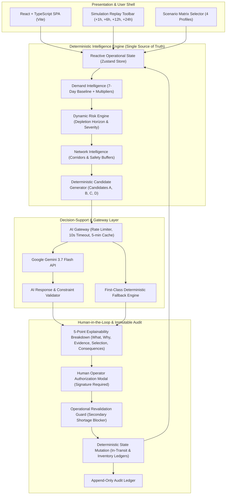

# TRANSFUSE — Smart Blood-Bank Inventory & Demand Intelligence

> **DEMO / HACKATHON PROTOTYPE SPECIFICATION**  
> **Target Event:** Smart India Hackathon 2026  
> **Official Product Name:** TBD (RAKTKOSH is a temporary demonstration codename)  
> **Deployment Status:** Production-Hardened Client-Side SPA + Deterministic Intelligence + Gemini Decision Support

---

## 1. Executive Overview

**TRANSFUSE** is a regional-scale smart blood-bank inventory management and demand intelligence platform. It interconnects disparate hospital blood banks (e.g., Central City General Hospital and Metropolitan Medical Center) into a coordinated supply network.

The system addresses critical operational failure modes in transfusion logistics:
1. **Unanticipated Emergency Depletion:** Multi-trauma incidents draining O-negative red cell reserves before routine restocking cycles.
2. **Preventable Expiration Wastage:** Platelets (5-day shelf life) and red cells (35-day shelf life) expiring in low-turnover facilities while tertiary trauma centers face stockouts.
3. **Transit Corridor Blind Spots:** Sub-optimal cross-facility transfers dispatched without cold-chain verification or secondary shortage risk validation.

---

## 2. Core Architectural Principles



### Strict Architectural Boundaries:
- **Deterministic Engine as Single Source of Truth:** Inventory units, demand calculations, depletion horizons, candidate transfer quantities, and simulation clock ticks are 100% deterministic and cannot be hallucinated.
- **Gemini as Decision-Support Layer:** Google Gemini 3.7 Flash analyzes pre-computed candidate actions and provides structured, evidence-grounded 5-point explainable rationale.
- **Zero Autonomous Execution:** No recommendation can mutate inventory directly. Mandatory human clinician/operator authorization signature is enforced.
- **Secondary Shortage Protection:** Before an inter-hospital transfer can be approved, the system mathematically verifies that `Source Available Units - Transfer Units >= 120% * Minimum Threshold`.
- **Pre-Execution Revalidation Guard:** If state changes (e.g. inventory consumed during simulation advancement) between recommendation generation and authorization, the system actively blocks execution (`RECOMMENDATION BLOCKED`).
- **Resilient Deterministic Fallback:** In the event of API timeout, rate limiting, network failure, or manual fail-mode toggle, the system seamlessly produces rule-based 5-point explainability with zero UI degradation.

---

## 3. Technology Stack

- **Framework:** React 18 with TypeScript
- **Build Tool:** Vite 5
- **State Architecture:** Zustand In-Memory Reactive Store
- **Styling:** Vanilla CSS Tokens + Tailwind CSS Utility Engine (Strict Institutional Palette)
- **Routing:** React Router DOM (v6 with client-side SPA rewrites)
- **AI Decision Support:** Google Gemini 3.7 Flash (`gemini-3.7-flash`)
- **Typography:** IBM Plex Sans, IBM Plex Mono, IBM Plex Sans Condensed
- **Deployment:** Vercel SPA Ready (`vercel.json`)

---

## 4. Repository Folder Structure

```
FRONTEND/
├── public/
│   └── favicon.svg
├── src/
│   ├── app/
│   │   ├── App.tsx                   # Main App shell
│   │   └── routes.tsx                # Route configuration
│   ├── components/
│   │   ├── layout/                   # Header, DemoBanner, Sidebar, Footer
│   │   ├── operational/              # Indicators, Matrices, Modals, Diagnostics
│   │   └── ui/                       # Accessible UI primitives (Button, Modal, Table, etc.)
│   ├── config/
│   │   ├── aiConfig.ts               # Centralized Gemini & rate-limit configuration
│   │   └── appConfig.ts              # Application & hospital network metadata
│   ├── data/
│   │   ├── mockData.ts               # 100% Synthetic baseline hospital data
│   │   └── selectors.ts              # Memoized store selectors
│   ├── intelligence/
│   │   ├── candidateGenerator.ts     # Candidates A, B, C, D generator
│   │   ├── contextBuilder.ts         # Sanitized context builder & fingerprinting
│   │   ├── demandIntelligence.ts     # Consumption rate & surge calculations
│   │   ├── deterministicDecisionSupport.ts # First-class deterministic explainability
│   │   ├── networkIntelligence.ts    # Feasibility & secondary buffer checker
│   │   └── riskEngine.ts             # State-driven risk derivation
│   ├── pages/
│   │   ├── Activity/                 # Immutable audit ledger
│   │   ├── Dashboard/                # Executive regional overview
│   │   ├── Forecast/                 # 24h/48h demand projections
│   │   ├── Inventory/                # Multi-node inventory ledgers & batch lots
│   │   ├── Landing/                  # Public landing & demonstration launchpad
│   │   ├── Network/                  # Transit corridors & inter-node logistics
│   │   ├── Privacy/                  # Synthetic data notice
│   │   ├── Recommendations/          # AI decision support & 5-point explainability
│   │   ├── Requests/                 # Clinical transfusion orders & reservation
│   │   ├── Risks/                    # Shortage & expiration intelligence matrix
│   │   ├── Terms/                    # Demonstration terms of use
│   │   └── Transfers/                # Logistics tracking & cold-chain compliance
│   ├── services/
│   │   ├── aiGateway.ts              # Rate limiter, cache, timeout, retries & fallback
│   │   └── aiValidator.ts            # Response schema & feasibility validator
│   ├── simulation/
│   │   └── simulationEngine.ts       # Simulation clock & time step state progression
│   ├── store/
│   │   └── useAppStore.ts            # Zustand unified operational store
│   ├── styles/
│   │   ├── globals.css               # Base CSS reset & no-shadow enforcement
│   │   └── tokens.css                # Institutional color & typography tokens
│   └── types/                        # Full domain TypeScript interfaces
├── .env.example                      # Environment variable template
├── .gitignore                        # Git secret & credential exclusion
├── package.json                      # Dependencies & scripts
├── tsconfig.json                     # Strict TypeScript compiler options
├── vercel.json                       # Vercel SPA rewrite & header configuration
└── vite.config.ts                    # Vite build configuration
```

---

## 5. Local Setup & Quickstart

### Prerequisites
- Node.js 18+ or 20+
- npm or yarn

### Installation
```bash
# 1. Clone the repository and navigate to the frontend directory
cd "FRONTEND"

# 2. Install dependencies
npm install

# 3. Create local environment configuration
cp .env.example .env

# 4. (Optional) Provide your Gemini API Key in .env
# VITE_GEMINI_API_KEY=your-api-key-here
# Note: If no key is provided, the platform automatically utilizes its high-speed
# validated simulation and deterministic fallback with identical explainability.

# 5. Start Vite development server
npm run dev
```

The application will be accessible locally at `http://127.0.0.1:3000`.

---

## 6. Gemini Configuration & Safety Architecture

| Configuration Parameter | Value | Description |
| :--- | :--- | :--- |
| **Model** | `gemini-3.7-flash` | Primary decision-support AI model |
| **Request Timeout** | `10,000 ms` | Hard timeout before fallback triggering |
| **Max Retries** | `1 retry` | Automatic retry with 1.5s backoff |
| **Response Cache TTL** | `300,000 ms (5 min)` | In-memory context fingerprint cache |
| **Rate Limit (Minute)** | `10 req / min` | Layer 2 protection against rapid UI requests |
| **Rate Limit (Hour)** | `30 req / hour` | Hourly burst quota |
| **Rate Limit (Day)** | `100 req / day` | Daily demonstration budget |
| **Client Cooldown** | `30 seconds` | Context deduplication window |
| **Fallback Engine** | `Deterministic` | Complete 5-point explainability guarantee |

### 5-Point Explainability Structure
Every AI recommendation is structured into 5 evidence-grounded sections:
1. **`01 WHAT`**: Exact transfer quantity, blood group, component, source, and destination.
2. **`02 WHY`**: Clinical justification and stockout prevention timeframe.
3. **`03 EVIDENCE`**: Measurable operational data points (depletion hours, surge multipliers, source buffer %, corridor status, lot expiration).
4. **`04 SELECTION`**: Rationale for choosing the primary candidate over alternatives (Candidates B, C, D).
5. **`05 CONSEQUENCES`**: State impact projection upon execution.

---

## 7. Evaluator Hero Demonstration Walkthrough

Follow these 10 steps to demonstrate the end-to-end intelligence and logistics lifecycle:

1. **Initial State Inspection (`/app`):**
   - Start in `NORMAL` scenario. Verify CCGH and MMC nodes are in stable operational equilibrium.
2. **Inject Trauma Surge (`Header`):**
   - Switch Scenario to **`Emergency Surge (Hero)`**.
   - Notice CCGH O- PRBC demand accelerates from baseline to `2.8x`.
3. **Advance Simulation Clock (`+6H`):**
   - Click `+6H` in the Header replay bar.
   - Observe CCGH O- PRBC inventory drop to 4 total units (1 available, 3 reserved). Depletion horizon drops to `<18 Hours`.
4. **Inspect Emerging Shortage (`/app/risks`):**
   - Navigate to Risks page. Confirm `RISK-SYN-001` is flagged as **`CRITICAL`** with a projected deficit of 20 units.
5. **Run AI Decision Support (`/app/recommendations`):**
   - Click **`⚡ RUN AI ANALYSIS (GEMINI)`**.
   - Observe Gemini 3.7 Flash evaluate 4 candidates and select **Candidate A (20-Unit Full Rebalance)**.
   - Inspect the **5-Point Explainability Breakdown** and **Live State Impact Projection**.
6. **Test Deterministic Fallback Mode (`DemoBanner`):**
   - In the top banner, toggle the **`LIVE`** button to **`FAIL MODE`**.
   - Re-run AI Analysis. Verify the badge changes to **`DETERMINISTIC FALLBACK`** with seamless explainability and zero error popups.
   - Toggle back to **`LIVE`**.
7. **Authorize Recommendation (`Modal`):**
   - Click **`AUTHORIZE DISPATCH ORDER`**.
   - Review pre-execution verification, enter operator signature (`Dr. Sunita Banerjee`), and confirm.
8. **Execute Logistics Dispatch (`/app/transfers`):**
   - On the Transfers page, click **`DISPATCH`** (`IN_TRANSIT` with active cold-chain temperature telemetry at `3.8°C`).
   - Click **`RECEIVE & RECONCILE`** to complete delivery.
9. **Verify Inventory Reconciliation (`/app/inventory`):**
   - Observe CCGH (HOSP-A) O- PRBC units increase from 4 to 24 units.
   - Observe MMC (HOSP-B) O- PRBC units decrease from 38 to 18 units (preserving the safe 120% buffer).
10. **Inspect Chronological Audit Ledger (`/app/activity`):**
    - Verify immutable records for `AI_REQUEST_STARTED`, `AI_RESPONSE_VALIDATED`, `RECOMMENDATION_APPROVED`, `TRANSFER_DISPATCHED`, `TRANSFER_RECEIVED`, and `INVENTORY_RECONCILED`.

---

## 8. Vercel Production Deployment

The repository includes a dedicated `vercel.json` configured for client-side SPA routing:

```bash
# Deploy via Vercel CLI
vercel --prod
```

### Environment Variables on Vercel Dashboard:
- `VITE_GEMINI_MODEL` = `gemini-3.7-flash`
- `VITE_AI_TIMEOUT_MS` = `10000`
- `VITE_AI_RATE_LIMIT_PER_MINUTE` = `10`
- `VITE_AI_RATE_LIMIT_PER_HOUR` = `30`
- `VITE_AI_RATE_LIMIT_PER_DAY` = `100`

---

## 9. Legal & Synthetic Data Notice

> **100% SYNTHETIC DATA BOUNDARY**  
> All patient IDs (`PAT-SYN-xxx`), order codes (`REQ-SYN-xxx`), transfer records (`TR-SYN-xxx`), lot batches (`LOT-SYN-xxx`), hospital names, and geographic coordinates are entirely fictional and synthetically generated for demonstration.  
>  
> **NON-CLINICAL DISCLAIMER:** RAKTKOSH is a technical proof-of-concept prototype. It is not a certified medical device and must not be used for clinical transfusion authorization or autonomous dispatch in production healthcare settings.
